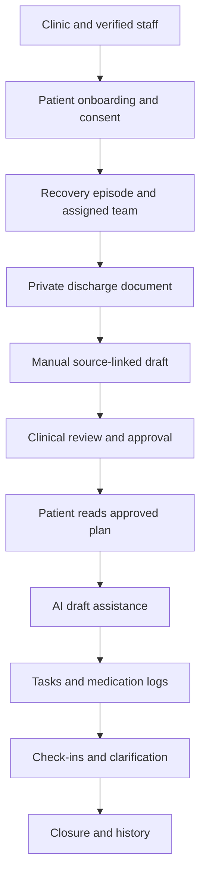

# Velora

**Secure, clinician-controlled post-discharge recovery coordination.**

Velora is a planned JavaScript MERN application that helps clinics convert private discharge information into clinician-approved recovery plans. Patients and explicitly authorized caregivers will later use those approved plans to understand instructions, record recovery activity and ask the assigned care team for clarification.

Velora does **not** diagnose, prescribe, decide clinical urgency, certify recovery or publish AI output automatically. AI assistance is planned only after the manual clinical review and approval workflow is implemented and verified.

> **Current status - 10 October 2026:** documentation and architecture baseline. The MERN implementation has not started in this repository. Part 1 is the next authorized engineering stage.

## Project authority

Read these three documents before implementation and whenever the owner says **Duck**:

| Document | Purpose |
|---|---|
| [Velora MERN Master](docs/VELORA_MERN_MASTER.pdf) | Product scope, VEL-001 through VEL-021, ten-part roadmap, clinical invariants and all 25 permanent security controls |
| [Velora MERN Architecture](docs/VELORA_MERN_ARCHITECTURE.pdf) | MERN system design, trust boundaries, data model, access policy, state machines, repository structure and verification strategy |
| [Velora MERN Duck Log](docs/VELORA_MERN_DUCK_LOG.pdf) | Current project truth, evidence classifications, Duck review procedure, completion gates and session history |

These PDFs are the current project authority. Code, tests and future documentation must remain consistent with them. A roadmap item is not evidence that a feature exists.

## Product flow



Manual clinical approval comes before AI assistance. Uploading a document or receiving an AI result can never activate patient instructions, tasks or reminders.

## Technology decision

The rebuild uses **JavaScript only**:

- **MongoDB + Mongoose** for persistence, indexes and replica-set transactions
- **Express.js + Node.js** for the API, authorization, workflows and provider boundaries
- **React.js + Vite** for accessible role-specific interfaces
- **Playwright** for browser journeys and viewport verification

The intended repository shape will be created in Part 1:

```text
Velora/
  client/
  server/
  docs/
  .github/workflows/
  .env.example
  .gitignore
  README.md
```

Exact dependency versions will be selected and pinned only after compatibility and security review. No storage, AI/OCR, notification, queue, hosting or managed database provider has been selected.

## Ten-part delivery plan

| Part | Deliverable | State |
|---:|---|---|
| 1 | Repository, authentication and clinic permissions | Planned - next stage |
| 2 | Patient onboarding, consent and caregiver access | Planned |
| 3 | Recovery episodes and care-team assignment | Planned |
| 4 | Private discharge-document intake | Planned |
| 5 | Manual care plans, review, approval and versioning | Planned - completes synthetic M1 |
| 6 | AI extraction, source citations and reviewed language | Planned |
| 7 | Medication schedules, daily tasks and actor-attributed logs | Planned |
| 8 | Check-ins, clarification queue, dashboard and reminders | Planned |
| 9 | Closure, audit, privacy requests, retention and metrics | Planned |
| 10 | Production hardening, restore and clinical-readiness gate | Planned |

Code 2 diagnostic tests/results and Code 3 insurance remain outside the active scope.

## Roles and access boundaries

| Role | Boundary |
|---|---|
| Patient | Own records and current approved plan; no clinical approval |
| Caregiver | Only explicitly active granular scopes; no automatic document access or onward invitation |
| Care coordinator | Assigned operational coordination and draft preparation; no clinical publication |
| Clinical reviewer | Assigned review and approval after clinic eligibility verification |
| Clinic admin | Staff and settings administration; admin status alone grants no clinical-record browsing |

Every protected operation must be enforced on the Express server using the authenticated identity, clinic, role, ownership or active assignment/grant, requested action and workflow state. React route protection is a user-interface layer, not the authorization boundary.

## Permanent security rules

- Real secrets, keys and credentials never enter Git, React bundles, screenshots, logs or error responses.
- `MONGODB_URI` and every credential are server-only environment variables.
- Commit `.env.example` with names and placeholders only. Never commit `.env` or `.env.*` files containing values.
- Passwords use Argon2id or bcrypt and are never stored in plaintext or reversible encryption.
- Use revocable server-side sessions in secure `httpOnly` cookies, MFA for staff, CSRF protection and an exact CORS allowlist.
- Validate and sanitize bodies, params, queries, headers, forms, filenames and uploads. Prevent NoSQL/operator injection and XSS.
- Apply security headers, safe structured errors, rate/resource limits, dependency audits and Git tree/history secret scans.
- Before any external API, disclose provider, purpose, API-key name, environment variable and exact backend/frontend location.
- Security is verified throughout every part, followed by an explicit end-of-part audit.

The complete 25-point contract is defined in the Master PDF and repeated in every implementation prompt.

## One-viewport application rule

Every authenticated application screen must fit within one viewport without page-level vertical scrolling.

- Long forms use multi-step wizards.
- Long lists and tables use server pagination.
- Many sections use tabs or separate routes.
- Charts use switchable panels.
- Mobile shows one primary panel at a time.
- `overflow: hidden` must never cut required content.

Required verification sizes are `1440x900`, `768x1024`, `390x844`, `320x568`, `844x390` and `320x400`. A marketing landing page may intentionally scroll.

## Duck review

At the start and end of every part:

1. Read the three authority PDFs and repository instructions.
2. Inspect the real branch, commit, dirty tree, source, configuration, dependencies, tests and CI.
3. Map behavior to VEL requirements, the active part and all 25 security controls.
4. Classify evidence as `VERIFIED`, `IMPLEMENTED / UNVERIFIED`, `PARTIAL`, `PLANNED`, `DRIFT` or `BLOCKED`.
5. Fix authorized in-scope drift, run the relevant checks and update the Duck Log.
6. Report exact evidence, failed or unavailable checks, remaining risks and the next authorized action.

Passing tests do not establish zero bugs, clinical validation, regulatory compliance or production readiness.

## Development and Git discipline

Part 1 will add verified setup commands after the actual package manifests exist. Until then, do not invent installation or execution instructions.

During implementation:

1. Work on a focused feature branch.
2. After each coherent feature or about 300 meaningful lines, run relevant tests and inspect the diff.
3. Create one meaningful commit and push it when authorized.
4. Target 50+ meaningful commits across the complete project without padding history.
5. Run the complete part gate, security audit and Duck review before merge.
6. Update this README and all applicable documents so they describe real behavior.

## Data and readiness boundary

Development uses synthetic identities and documents only. Before any real-patient pilot, Velora requires clinical workflow review, privacy/provider decisions, retention and incident processes, verified staff onboarding, secure deployment, backup plus isolated restore testing, representative extraction/language evaluation and explicit owner authorization.

## Owner

Velora is maintained by **Swayam Jain**.
